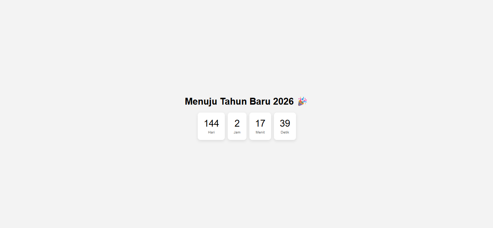

</img>

# Countdown Timer Web

Countdown Timer sederhana berbasis HTML, CSS, dan JavaScript. Cocok digunakan untuk menghitung waktu menuju acara seperti tahun baru, launching, atau event kampus.

## 🔧 Fitur

- Tanpa library tambahan (pure JS)
- Bisa disesuaikan ke tanggal & waktu apapun
- Tampilan modern & responsif
- Mudah digunakan dan disimpan dalam satu file `.html`

## 📁 Struktur File

Semua ditulis dalam 1 file HTML:

- `<h1>`: Judul acara
- `<div id="countdown">`: Menampilkan sisa waktu
- `<script>`: Kode logika countdown
- `<style>`: Styling tampilan

## ▶️ Cara Menggunakan

1. Buka Notepad atau VS Code
2. Paste kode dari `index.html`
3. Ganti target waktu di bagian berikut:
   ```js
   const timer = new CountdownTimer('2025-12-31T23:59:59', ...
4. Simpan sebagai countdown.html
5. Buka di browser

   🧪 Contoh
Menampilkan countdown menuju Tahun Baru 2026:

Menuju Tahun Baru 2026 🎉  
150 Hari  |  3 Jam  |  20 Menit  |  50 Detik
⚙️ Customisasi
Ganti teks <h1> untuk nama event

Ganti warna/ukuran font di bagian CSS

Tambahkan animasi, suara, atau tombol jika ingin

📜 Lisensi
Proyek ini bebas digunakan untuk keperluan pribadi maupun pendidikan.
